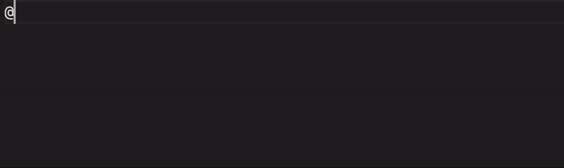

# BibLaTeX Snippets

Adds all identifiers for editing .bib files in BibLaTeX. An additional 'field' snippet is included to add optional fields to BibLaTeX entries.

Issues and Pull Requests are welcome!

## Usage

To activate the auto completion (snippet dropdown) you'll probably have to use the hotkey manually. LaTeX Workshop (the most popular LaTeX extension) marks everything except entries inside an `.bib` as comments. Therefore you'll probably have to press auto complete - the default is `ctrl + space`.

## Features

This extensions supports all types of BibLaTeX entries listed in the [documentation (german)](http://mirrors.ibiblio.org/CTAN/info/translations/biblatex/de/biblatex-de-Benutzerhandbuch.pdf).

**Other additions:**

- A `field` snippet is generating an additional field for an entry.
- A `@online-clipboard` snippet, using the clipboard content as an URL for creating an online entry.

